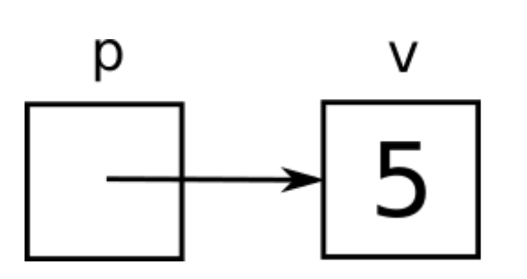

# Lab 5 - Ponteiros e `structs`

| Pasta                       | Arquivo  |
|-----------------------------|----------|
| `code/05-ponteiros-structs` | `main.c` |

!!! info
    Por favor, façam esta atividade em dupla e lembrem das regras.

    1. Os enunciados de programação dizem "o que" a função/programa deve fazer,
     mas não dizem "como" deve fazer. Não pergunte "como", pois descobrir isso é
     justamente uma das habilidades que vocês precisam exercitar para as três
     disciplinas.

    2. Ao terminar um exercício de programação, chame um dos professores para
     testemunhar o programa funcionando e validar o código. Não avance no guia
     até fazer isso, para termos certeza que você está passando por todo o
     processo.

## Introdução

Podemos dizer que praticamente todos os conceitos vistos até agora são
adaptações de conceitos vistos anteriormente em *Python* e *Java*. Neste guia,
finalmente exploramos alguns conceitos "exclusivos" de *C* e outras linguagens
de baixo nível.

Para introduzir o primeiro deles, vamos começar com uma pergunta.

!!! question medium
    Considerando o que vimos anteriormente sobre `scanf`, *passagem por valor* e
    *passagem por referência*, porque a chamada

    ~~~{.c}
    scanf("%d", &n);
    ~~~

    não funcionaria sem o `&`? Pode parecer estranho, mas você não precisa saber a
    definição de `&` para poder responder!

!!! warning
    Não vá para a próxima página antes de validar suas respostas com um dos professores.

## Endereços

Como vimos anteriormente, os conjuntos de variáveis de duas funções diferentes
são totalmente separados. Ou seja, no exemplo abaixo,

~~~{.c}
    void foo(int n) {
        n++;
    }

    int bar() {
        int n = 0;
        foo(n);
        return n;
    }
~~~

a função `bar` devolve `0`, pois a variável `n` de `foo` é diferente da variável
`n` de `bar`, apesar das duas terem o mesmo nome.

Cabe enfatizar que é bom que esse seja o comportamento padrão! Geralmente
queremos evitar situações nas quais uma função altera variáveis de outra função.
Essas situações são conhecidas como *efeitos colaterais* e costumam ser
indesejadas por tornarem o código mais imprevisível, aumentarem a probabilidade
de bugs e dificultarem testes.

No entanto, se soubermos muito bem o que estamos fazendo, efeitos colaterais
podem ser úteis. O `scanf` é o exemplo óbvio disso! Então vamos mostrar como
permiti-los.

O problema do exemplo anterior é que o *nome* de uma variável é um identificador
*local*, ou seja, vale apenas dentro do escopo da função na qual a variável foi
declarada. Mas a variável também possui um identificador *global* que é seu
*endereço*. Se uma função sabe o endereço de uma variável, essa variável pode
ser modificada pela função mesmo se não foi declarada dentro dela.

Para entender melhor o conceito de endereço, basta pensar na memória como um
"vetorzão" e na variável como um elemento desse "vetorzão". O endereço, nessa
analogia, seria o índice desse elemento.

E como obtemos o endereço de uma variável? Basta usar o operador unário `&`.
Isso explica o que acontece em relação ao `scanf`: o que a função recebe não é o
valor de uma variável, e sim seu endereço. Assim, ganha o poder de escrever nela
o valor digitado pelo usuário. Então lembre-se: **sempre que encontrar o símbolo
`&`, leia como se ele fosse a expressão "endereço de"**.

~~~{.c}
    &a         // lê-se "endereço de a"
    &b         // lê-se "endereço de b"
    &abobrinha // lê-se "endereço de abobrinha"
~~~

Mas para podermos passar endereços para lá e para cá, precisamos de variáveis
especiais que guardam endereços. Essas variáveis são conhecidas como
*apontadores* ou *ponteiros* (*pointers* em inglês) e indicadas pelo símbolo
`*`. Antes de dar mais detalhes, vamos dar uma dica simples e valiosa em relação
a esse símbolo.

## A Regra de Ouro

Dizemos que um apontador `p` *aponta* para uma variável `v` se o endereço de `v`
está armazenado em `p`. Visualmente, podemos representar isso da seguinte forma:

Esta figura é uma representação visual de `p` apontar para `v`. Nesse caso, `v` é uma variável
inteira cujo valor é `5` e `p` é um apontador cujo valor é o endereço de
`v`. Acostume-se com essa representação visual, aliás, pois ela será muito usada em
*Desafios de Programação*!

Mas o que realmente queremos enfatizar aqui é que, a partir dessa terminologia,
podemos derivar uma pequena regra que ajuda muito a compreender códigos que usam
`*` no contexto de endereços e apontadores: **sempre que encontrar o símbolo
`*`, leia como se ele fosse a expressão "variável apontada por"**.

Sem contexto essa regra parece estranha, então vamos aos exemplos!

## Apontadores

Vamos declarar o apontador `p` do exemplo acima.

~~~{.c}
    int *p;
~~~

Por que estamos usando `int`? Porque apontadores em C *não sabem o tipo da variável
para a qual apontam*, portanto esse tipo deve estar na declaração. Assim, a
combinação de `int` seguido por `*` representa a declaração de um apontador para
variável inteira.

Difícil lembrar? Então note que essa sintaxe é totalmente coerente com a regra
de ouro! A declaração `int v` significa "`v` é inteira", enquanto a declaração
`int *p` significa "variável apontada por `p` é inteira".

Vamos agora armazenar o endereço de `v` em `p`, reproduzindo a situação da
figura.

~~~{.c}
    int v;
    int *p;

    v = 5;
    p = &v;
~~~

Esse código faz sentido para você? Vejamos se você está entendendo...

!!! question short
    Adicionar `v = &5` ao exemplo acima seria válido?

!!! question short
    Adicionar `v = p` ao exemplo acima seria válido?

!!! question short
    Adicionar `v = &p` ao exemplo acima seria válido?

!!! question short
    Adicionar `p = 5` ao exemplo acima seria válido?

!!! question short
    Adicionar `p = &5` ao exemplo acima seria válido?

!!! question short
    Adicionar `p = v` ao exemplo acima seria válido?

!!! warning
    Não continue antes de validar suas respostas com um dos professores.

Agora vejam como o exemplo abaixo é interessante.

~~~{.c}
    int v;
    int *p;

    v = 5;
    p = &v;

    *p = 10;

    printf("%d", v);
~~~

!!! question short
    Qual é a saída desse exemplo? Pense na regra de ouro.

    ??? note "Resposta"
        A saída é `10`, pois a linha `*p = 10`, pela regra de ouro, pode ser lida como
        "variável apontada por `p` recebe `10`". E qual é a variável apontada por `p`?

!!! warning
    Não vá para a próxima parte antes de validar suas respostas com um dos
    professores.

De fato, podemos usar `*p` como sinônimo de `v` ao longo do código.

~~~{.c}
    int v;
    int *p;

    v = 5;
    p = &v;

    printf("%d", *p);
~~~

Obviamente, esse uso só é válido a partir do momento em que `p` recebe o
endereço de `v`. Antes de receber a primeira atribuição, `p` guarda lixo de
memória, como qualquer variável.

## A Única Exceção

A única exceção à regra de ouro é a situação na qual o apontador é inicializado
na declaração.

~~~{.c}
    int v = 5;
    int *p = &v;
~~~

Nesse caso, a regra é coerente com a declaração, mas não é coerente com a
atribuição. Quem recebe o endereço de `v` é `p` e não a variável apontada por
`p`. Aliás, nesse momento, nem existe uma variável apontada por `p`, já que `p`
está com lixo de memória.

Mas essa é a única exceção com a qual você precisa se preocupar!

## Aplicação de Apontadores

Uma aplicação comum de apontadores é seu uso para contornar o fato de que o
`return` de uma função devolve um único valor. Considere a função abaixo, que
calcula ao mesmo tempo a soma e a subtração de dois inteiros. Essa função está
**errada**, pois o `return` de dois valores separados por vírgula é permitido em
Python mas **não** em C. Apenas um valor pode ser devolvido em C.

~~~{.c}
    int sum_sub(int a, int b) {
        int sum = a + b;
        int sub = a - b;
        return sum, sub; // oops...
    }
~~~

Para contornar isso, podemos fazer uma função que não devolve nada, ou seja é do
tipo `void`, mas *escreve a resposta em duas variáveis cujos endereços são
recebidos como parâmetros*.

~~~{.c}
    void sum_sub(int a, int b, int *psum, int *psub) {
        *psum = a + b;
        *psub = a - b;
    }
~~~

Entender o uso dos símbolos `*` acima não deveria ser um problema se você
absorveu bem a regra de ouro!

!!! warning
    Sim, é feio. Muito feio. Mas funciona.

Repare que chamamos os parâmetros de `psum` e `psub` em vez de `sum` e `sub`.
Não faria sentido chamar de `sum` e `sub`, pois eles não armazenam os resultados
em si e sim os endereços das variáveis onde eles devem ser armazenados.

!!! example
    Escreva um programa completo que:

    1. usa `scanf` para ler dois inteiros dados pelo usuário;

    2. usa `sum_sub` para calcular a soma e a subtração desses dois inteiros;

    3. usa `printf` para mostrar os dois resultados.

!!! example
    Escreva um programa completo que:

    1. usa `scanf` para ler dois inteiros dados pelo usuário;

    2. supondo que os dois inteiros representam a altura e a largura de um
     retângulo, usa uma função para calcular o perímetro e a área desse
     retângulo;

    3. usa `printf` para mostrar os dois resultados.

!!! warning
    Não continue antes de validar suas respostas com um dos professores.

Endereços e apontadores são considerados conceitos particularmente difíceis de
entender para quem está aprendendo C pela primeira vez. Mantenha sempre a regra
de ouro em mente para auxiliar nesse processo.

## Structs

Outro conceito introduzido neste guia é o de `struct`. Trata-se de um recurso
que responde a uma das dúvidas mais antigas da humanidade: *como podemos
armazenar múltiplos valores em uma única variável*?

(meu conhecimento de história talvez seja um pouco questionável)

Structs são tipos compostos que armazenam múltiplos valores. Para vocês que já
aprenderam orientação a objetos, pode-se dizer que eles são mais ou menos como
"objetos sem métodos, apenas atributos".

Suponha por exemplo que, para um programa de geometria analítica, queremos
definir um tipo que representa um ponto do plano cartesiano e, portanto, possui
dois valores: a coordenada horizontal e a coordenada vertical. Declarar um
struct que representa esse tipo é mais ou menos simples.

~~~{.c}
    struct ponto {
        int x;
        int y;
    };
~~~

Dizemos "mais ou menos" por causa de dois detalhes chatos: o primeiro é esse
maldito ponto e vírgula no final, que você *com certeza* vai esquecer em vários
momentos da vida. O segundo é o fato de que essa declaração não cria um tipo
chamado `ponto`, mas sim um tipo chamado `struct ponto`. Ou seja, para declarar
uma variável desse tipo novo precisamos escrever

~~~{.c}
    struct ponto p;
~~~

o que é um tanto quanto verborrágico.

Contra o primeiro detalhe não podemos fazer muita coisa, mas contra o segundo
existe um recurso muito útil em C que é o `typedef`. Esse recurso nos permite
criar "apelidos" para tipos. Assim, podemos reescrever a declaração do struct da
seguinte forma

~~~{.c}
    typedef struct {
        int x;
        int y;
    } ponto;
~~~

que significa "struct anônimo com apelido `ponto`". Agora sim, para declarar uma
variável desse tipo novo podemos escrever simplesmente

~~~{.c}
    ponto p;
~~~

E como usar essa variável? Basta usar o operador `.` para acessar seus valores,
como em objetos Java.

~~~{.c}
    p.x = 10;
    p.y = 20;

    scanf("%d", &p.x);
    scanf("%d", &p.y);

    printf("%d", p.x);
    printf("%d", p.y);
~~~

!!! example
    Reescreva a função de duas aulas atrás para calcular a *distância de Manhattan*
    entre dois pontos. Mas, agora que temos o struct acima, a função deve
    receber duas variáveis do tipo `ponto` em vez de receber quatro variáveis do
    tipo `int`.

    Escreva sua solução em `tarefa3.c` e teste usando `make tarefa3`.

!!! example
    Escreva um programa completo que:

    1. usa `scanf` para ler quatro inteiros dados pelo usuário;

    2. supondo que esses inteiros representam as coordenadas de dois pontos
     cartesianos, usa a função anterior para calcular a distância de Manhattan;

    3. usa `printf` para mostrar o resultado.

!!! example
    Refaça os dois exercícios anteriores, substituindo a distância de Manhattan
    pela distância *Euclidiana*. (pesquise)

!!! warning
    Não continue antes de validar suas respostas com um dos professores.

## Apontadores para Structs

Quando misturamos os conceitos de apontador e struct, algo que também será feito
em *Desafios de Programação*, a sintaxe vira um pesadelo críptico.

~~~{.c}
    ponto p;
    ponto *pp;

    pp = &p;

    (*pp).x = 10;
    (*pp).y = 20;
~~~

Pare. Respire. Não continue a ler até aceitar que o código acima faz sentido.
Lembre da regra de ouro.

!!! question short
    Por que `pp.x` não faria sentido no exemplo acima?

!!! warning
    Não vá para a próxima página antes de validar suas respostas com um dos
    professores.

Felizmente, os criadores do C perceberam que a sintaxe fica meio pesada nesse
caso e adicionaram o operador "setinha" (`->`) para ajudar. Grosso modo, esse
operador significa "operador `.`, mas em relação à variável apontada". Ou seja,
o trecho

~~~{.c}
    (*pp).x = 10;
    (*pp).y = 20;
~~~

pode ser substituído pelo trecho

~~~{.c}
    pp->x = 10;
    pp->y = 20;
~~~

Pare e respire de novo.

!!! question short
    Por que `p->x` não faria sentido no exemplo acima?

!!! warning
    Não continue antes de validar suas respostas com um dos professores.

!!! example
    Escreva uma função

    ~~~{.c}
    int medio(ponto a, ponto b, ponto *m)
    ~~~

    que recebe dois pontos e o endereço de um terceiro ponto. Essa função deve
    calcular o *ponto médio* dos dois pontos e escrever o resultado desse cálculo
    no terceiro. Simples, não? Porém, há um detalhe: essa função *deve considerar
    inválido o caso em que os dois pontos são exatamente iguais*.

    Reparou que, apesar de devolver a resposta via apontador, a função é do tipo
    `int`? É porque ela deve devolver um código indicando se o caso foi válido ou
    não. Se os dois pontos são iguais, ela deve devolver `0` e não escrever nada
    no terceiro. Se os dois pontos são diferentes, ela deve devolver `1` e
    escrever o resultado no terceiro.

    Escreva sua solução em `tarefa6.c` e teste usando `make tarefa6`.

!!! warning
    Não considerem terminado antes de validar suas respostas com um dos professores.

