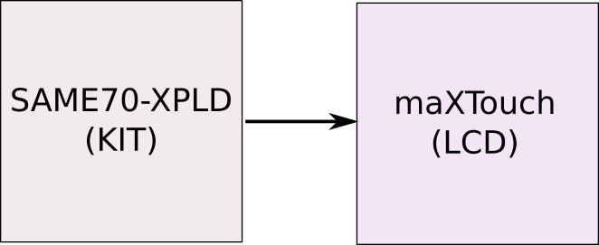
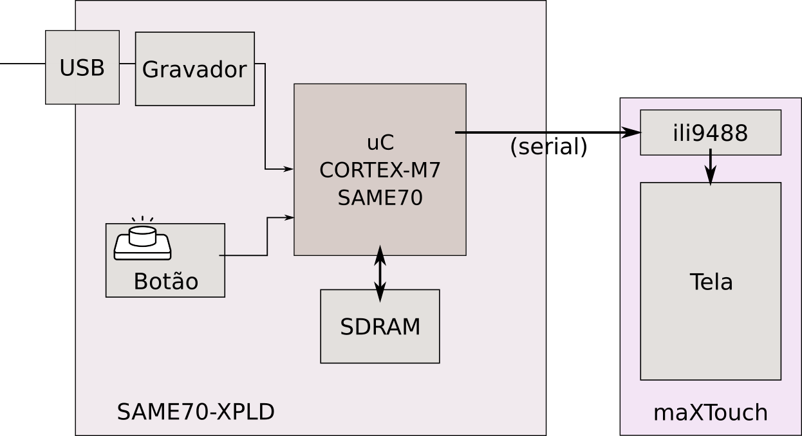
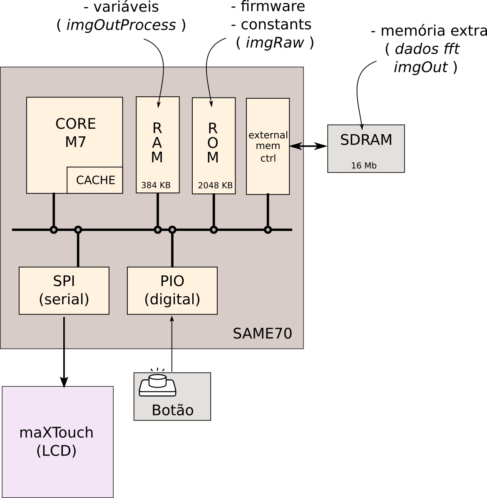

# Embarcados - Parte 2


## Melhorando o desempenho 

Assim como qualquer sistema microprocessado podemos ajustar diversos parâmetros interno de funcionamento do microcontrolador. Sendo o clock (frequência de operação) um dos fatores que possui grande impacto na aplicação. 

É natural pensarmos que quanto maior a frequência do clock maior será o gasto energético de um sistema, lembre de camada física onde vimos que o gasto energético em sistemas digitais construídos com MOSFET é:

$$
\alpha C V_{DD}^2 f
$$

onde :

- $\alpha$: fator de chaveamento (influenciado pelo código)
- $C$: capacitância
- $V$: tensão de operação
- $f$: frequência de chaveamento

Portanto quanto maior a frequência de chaveamento maior será o gasto energético do sistema, mas um detalhe deve ser levado em consideração: quanto maior a frequência do clock mais rápido uma tarefa é realizada e mais rapidamente um sistema pode entrar em modo de baixo consumo energético *sleep mode, suspensão, ....*.

!!! note
    Recentemente o kernel do linux removeu o perfil *ondemand* de seus [modos de operação](https://www.phoronix.com/scan.php?page=news_item&px=MTM3NDQ), esse modo alterava dinamicamente a frequência de operação do processador para alta quando uma grande carga de processamento era demandada e para mais baixa quando o processador estava em baixo uso.

    A ideia inicial disso era a melhoria do consumo energético já que o processador se ajustava a demanda do sistema. Porém detectou-se que isso não era verdade, já que esse modo tardava o processador de entrar no modo de *sleep* mais profundo além de demandar processamento para verificar a carga atual do processador.

## Alterando a frequência de operação

O arquivo .h localizado em: `src/config/conf_clock.h` é responsável pela configuração do clock do microcontrolador. Note que no trecho de código referente ao `Prescaler` existem diversas opções que podem ser escolhidas, a atual está definda como:

```c
// ===== Processor Clock (HCLK) Prescaler Options   (Fhclk = Fsys / (SYSCLK_PRES))
//#define CONFIG_SYSCLK_PRES          SYSCLK_PRES_1
//#define CONFIG_SYSCLK_PRES          SYSCLK_PRES_2
//#define CONFIG_SYSCLK_PRES          SYSCLK_PRES_4
//#define CONFIG_SYSCLK_PRES          SYSCLK_PRES_8
//#define CONFIG_SYSCLK_PRES          SYSCLK_PRES_16
//#define CONFIG_SYSCLK_PRES          SYSCLK_PRES_32
#define CONFIG_SYSCLK_PRES          SYSCLK_PRES_64
//#define CONFIG_SYSCLK_PRES          SYSCLK_PRES_3

```

Onde `Fsys` é equivalente a **300Mhz**. Na configuração inicial a frequência do processador é 300Mhz/64 = 4.5 MHz, altere esse trecho para a forma a seguir, selecionando a frequência do principal do uC para 300Mhz.

```c
// ===== Processor Clock (HCLK) Prescaler Options   (Fhclk = Fsys / (SYSCLK_PRES))
#define CONFIG_SYSCLK_PRES          SYSCLK_PRES_1
//#define CONFIG_SYSCLK_PRES          SYSCLK_PRES_2
//#define CONFIG_SYSCLK_PRES          SYSCLK_PRES_4
//#define CONFIG_SYSCLK_PRES          SYSCLK_PRES_8
//#define CONFIG_SYSCLK_PRES          SYSCLK_PRES_16
//#define CONFIG_SYSCLK_PRES          SYSCLK_PRES_32
//#define CONFIG_SYSCLK_PRES          SYSCLK_PRES_64
//#define CONFIG_SYSCLK_PRES          SYSCLK_PRES_3

```

!!! example "Testando"
    - Compile e embarque o firmware com essa mudança.
    - Verifique a nova taxa de atualização do LCD, melhorou?


## Como tudo isso funciona?

Em uma visão mais geral podemos analisar o sistema como um kit de desenvolvimento e um display LCD:

{width=40%}

### Sistema detalhado

Uma análise mais detalhada do projeto pode ser visto no diagrama de blocos a seguir:



Esse projeto é implementando em um kit de desenvolvimento para microcontroladores ARM Cortex M7 do fabricante Microchip/ATMEL (a ARM não fabrica chips, somente propriedade intelectual). Esse microcontrolador é chamado de **SAME70** e o kit de desenvolvimento **SAME70-XPLD**. O kit possui além do microcontrolador toda a infraestrutura necessária para o seu funcionamento e mais alguns periféricos que podem ser úteis no desenvolvimento de um projeto (gerenciador de energia, gravador, memória, botão, led).

Pelo diagrama detalhado nota-se que a comunicação do uC com o LCD é realizado via uma interface serial (lembra da `UART` de Camada Física? aqui usa-se uma outra comunicação similar chamada de `SPI`). No módulo do LCD um chip dedicado para o controle do display (`ili9488`, da mesma família do display de elementos de sistema) recebe instruções do uC e atualiza o LCD.

!!! note
    Microcontroladores não necessitam geralmente de memória externa para o seu funcionamento, porém é a mesma deve sert utilizada quando a aplicação necessita de uma quantidade razoável de memória. No caso desse microcontrolador possui internamente "somente":

    - 384 KBytes de RAM
    - 2   MBytes de ROM

    "somente" se compararmos com a capacidade de armazenamento de um computador, mas se compararmos com outros microcontroladores esse possui **muita** memória.

Essa memoria interna do uC não foi suficiente para a nossa aplicação de exemplo, tivermos que recorrer a essa memória externa (SDRAM).

### microcontrolador

Podemos detalhar ainda mais o sistema se detalharmos o que está sendo usado no microcontrolador, entendendo todas as partes em uso. Pelo diagrama podemos notar os seguintes "periféricos":

- CORE M7: Unidade de processamento ARM.
- RAM: Unidade de memória que é usada durante execução (variáveis).
- ROM: Unidade de memória usada para armazenar o programa e constantes .
- External Memory Controller: Periférico responsável por gerenciar uma memória externa.
- SPI: Periférico responsável pela comunicação serial SPI e interface com o módulo LCD.
- PIO: Periférico responsável pela interface com entradas e saídas digitais (Parallel Input/OutPut).

{width=80%}.

# Firmware 

O arquivo principal desse projeto é o `main.c` (é muito comum em C a função main() estar no arquivo main.c, mas não é necessário), esse código fonte possui a função `main()` que é a primeira a ser chamada na inicialização do sistema. Nessa função inicializa-se primeiro o sistema embarcado e seus periféricos (clock, LCD, botão, memória) via a chamada de função `initBoardMutirao()`. Após inicializado a placa chama-se a função `imgshow(...)` que possui toda a parte responsável por exibir a imagem no LCD. 

Trecho do arquivo `main.c`

```C
int main(){
 	uint32_t time;            // variavel para armazenar tempo de processamento
	uint8_t  imageSelect = 1; // variavle para selecao da imagem a ser exibida
                              // quando o botao for pressionado
                              // 1 = imagem processada
                              // 0 = imagem orignal

	// inicializa placa e seus perifericos
	initBoardMutirao();

	// exibe imagem orignal, tempo de processamento suprimido.
	imgShow(imgRaw, 0);
    
    ...
```

A função `imgShow` possui dois parâmetros: a imagem `image[320][320]` a ser exibida, passada como uma matriz de tamanho já definido, e o tempo de processamento a ser exibido no LCD:

```C
    void imgShow(ili9488_color_t image[320][320], uint32_t time){...}
```

Após essa etapa o microcontrolador entra em um loop infinito (`while(1){}`) que verifica uma variável chamada de `buttonFlag` que é alterada via uma interrupção para o valor **1** sempre que o botão for pressionado. 

```C
// super loop
	// aplicacoes embarcadas não devem sair do while(1).
	while (1) {

		// se buttonFlag = 1 existe alteracao no estado do botao
		if(buttonFlag){
```


