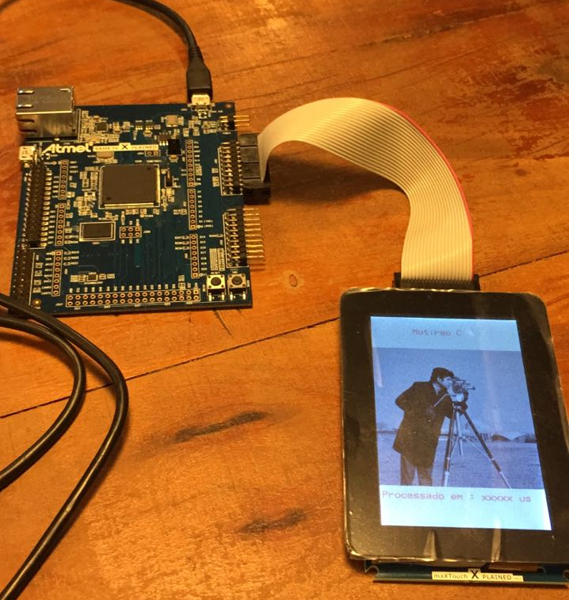
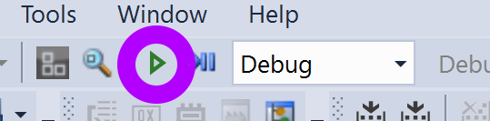

# Embarcados - Parte 1

!!! warning
    Essa atividade demanda sistema operacional Windows, conforme descrito na infra de [Computação
    Embarcada](https://insper.github.io/ComputacaoEmbarcada/Sobre-Ferramental/)

Nessa aula iremos trabalhar com os conceitos básicos da linguagem C aplicados ao processamento de imagem em sistemas embarcados. Para isso utilizaremos um kit de desenvolvimento com um microcontrolador ARM cortex M7 e um LCD colorido de 480x320 px conectado a esse kit. 

!!! note "Detalhe do material utilizado"
    - Kit : [SAME70-XPLD](http://www.microchip.com/DevelopmentTools/ProductDetails.aspx?PartNO=ATSAME70-XPLD)
    - Microcontrolador : [ARM Cortex M7](https://www.youtube.com/watch?v=GaV1j_5UVys)
    - LCD : [maXTouch Xplained Pro](http://www.microchip.com/Developmenttools/ProductDetails.aspx?PartNO=ATMXT-XPRO)

## Parte 1

Nesse primeira etapa iremos executar um código exemplo no sistema embarcado, para isso será necessário:

- [ ] Conectar o LCD ao kit
- [ ] Conectar o kit no computador
- [ ] Abrir e compilar o projeto no AtmelStudio
- [ ] Programar o microcontrolador
- [ ] Validar o resultado esperado

Antes de prosseguir você deve ter o repositório **Labs C** já clonado no seu computador (Windows).

### Conectando o LCD

!!! warning
    Tome cuidado ao manusear a placa, não coloque ela sobre outros materiais.

{: style="width:400px"}

{: style="width:400px"}

!!! note ""
    Considerando que os [pré requisitos](https://insper.github.io/ComputacaoEmbarcada/Sobre-Ferramental/#softwares)  para a disciplina de Computação Embarcada já foram instalados.

Conectar o USB do programador no computador:
    
{width=40%}
 
!!! tip
    Note que a placa possui dois USB: `DEBUG USB`, usado para programar o uC e `TARGET USB` usado para projetos que demandam conectividade via USB.
 
### AtmelStudio
 
Abra o projeto exemplo (`SAME70-MutiraoC`) localizado no repositório do 'Labs-de-C':

- https://github.com/Insper/Labs-de-C/tree/master/day-one/SAME70-MutiraoC

O projeto irá abrir na IDE do AtmelStudio como imagem a seguir:
    
.
 
### Compilar e programar
 
A etapa atual será a de embarcar o código exemplo no uC, para isso basta clicar em **Start Without Debug**:

{width=30%}.

### Testando

Uma vez embarcado o exemplo o LCD deverá exibir uma imagem. A primeira imagem que aparece é a imagem original sem nenhum tipo de modificação, ao apertar o botão **SW0** do kit de desenvolvimento uma função (**imageProcess()**) é chamada e a imagem orignal é processada e seu resultado exibido na tela (junto com o tempo de processamento).

{width=30%}.

!!! tip
    Se pressionar o outro botão o uC será reiniciado (reset).

!!! note
    Reparou que o sistema de modo geral está muito lento? Vamos melhorar isso!
